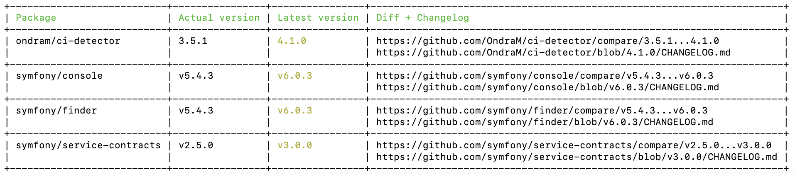

# eFabrica Composer plugin

## Installation
```shell
composer global require efabrica/composer-plugin
```

Answer `y` to question:
"Do you trust "efabrica/composer-plugin" to execute code and wish to enable it now? (writes "allow-plugins" to composer.json)"

## Command
This plugin allows you to use additional command:

### extended-outdated
Shows a list of installed packages that have updates available, including their latest version. If possible, it also shows URL to diff and changelog.



#### Usage
In your application root dir run:
```shell
composer extended-outdated 
```

#### Options
    --filter=FILTER                            Name of package(s) including a wildcard (*) to filter lists of packages.
    --locked                                   List all locked packages
    --ignore=IGNORE                            Ignore specified package(s). Use it with the --outdated option if you don't want to be informed about new versions of some packages. (multiple values allowed)
    -m, --minor-only                           Show only packages that have minor SemVer-compatible updates. Use with the --outdated option.
    -D, --direct                               Shows only packages that are directly required by the root package
    --strict                                   Return a non-zero exit code when there are outdated packages
    -f, --format=FORMAT                        Format of the output: text or json [default: "text"]
    --no-dev                                   Disables search in require-dev packages.
    --ignore-platform-req=IGNORE-PLATFORM-REQ  Ignore a specific platform requirement (php & ext- packages). Use with the --outdated option (multiple values allowed)
    --ignore-platform-reqs                     Ignore all platform requirements (php & ext- packages). Use with the --outdated option
    --host-to-type=HOST-TO-TYPE                Add hosts to type map. Use pipe to separate host and type, e.g. --host-to-type="my.gitlab.org|gitlab" (multiple values allowed)
    -h, --help                                 Display help for the given command. When no command is given display help for the list command
    -q, --quiet                                Do not output any message
    -V, --version                              Display this application version
    --ansi|--no-ansi                           Force (or disable --no-ansi) ANSI output
    -n, --no-interaction                       Do not ask any interactive question
    --profile                                  Display timing and memory usage information
    --no-plugins                               Whether to disable plugins.
    --no-scripts                               Skips the execution of all scripts defined in composer.json file.
    -d, --working-dir=WORKING-DIR              If specified, use the given directory as working directory.
    --no-cache                                 Prevent use of the cache
    -v|vv|vvv, --verbose                       Increase the verbosity of messages: 1 for normal output, 2 for more verbose output and 3 for debug

#### Known limitations
1. Command is trying to find changelog file in vendor's dir. It can't be done if it wasn't created or if it is ignored for export (e.g. in .gitattributes)
2. Command creates wrong urls if the release name is different from the tag name (Github)
3. Command now supports only Github and Gitlab types of urls

## Contribution
If you find any issue or you just want to make this plugin better, feel free to contribute.
